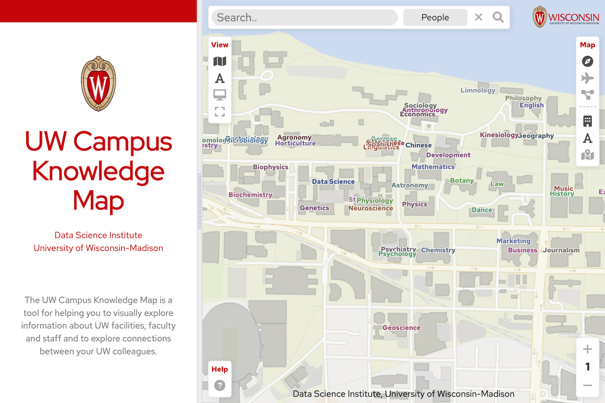
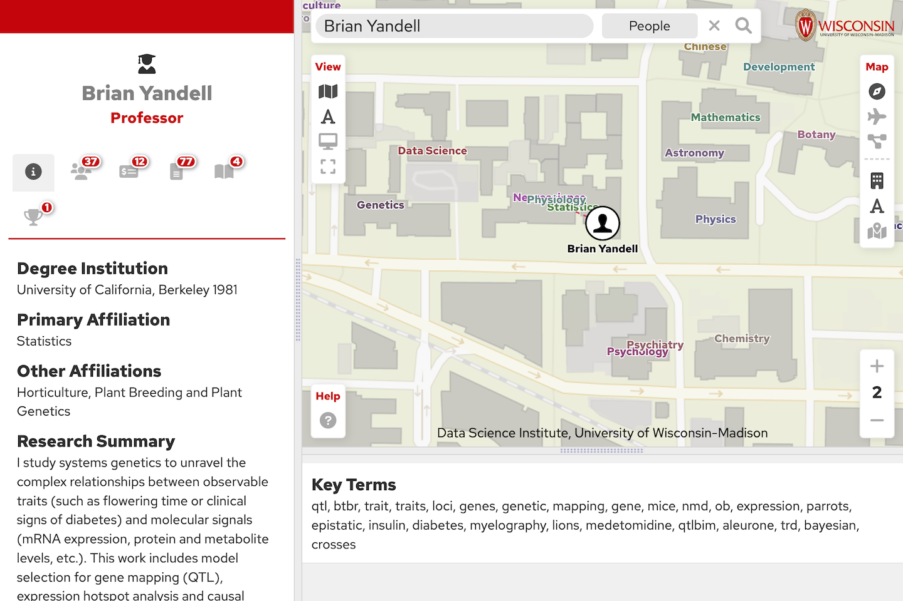
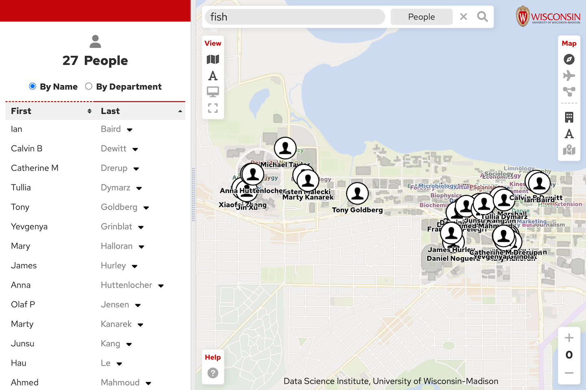
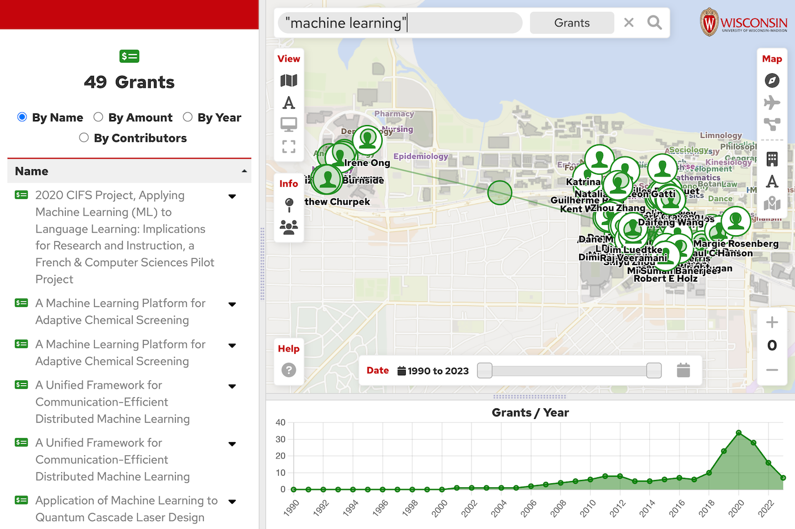

  

    
  

# UW Campus Knowledge Map

The knowledge map is a an interactive web-based mapping application that enables a visual exploration of people, collaborations, and activities at the University of Wisconsin-Madison.

# Capabilities

The knowledge map allows you to search for a wide variety of items including:
- People
    - search by name
    - search by area of interest
    - view a person's profile, their collaborator network and their activities
- Activities
    - search by topic
    - categories include grants, articles, chapters, books, proceedings, patents, technologies, awards
- Places
    - search by name
    

Search By Person

Search People By Topic

Search Activities

## Requirements

### 1. PHP 8.0+

The knowledge map uses Laravel9 which relies upon PHP 8.0 or later.

### 2. Web Server

This map application requires Apache or another similar web server.

### 2. SQL Database

The knowledge map uses SQL for storing building information.

- Knowledge map server

## Installation

Instructions coming soon.

<!-- LICENSE -->
## License

Distributed under the MIT License. See `LICENSE` for more information.

<!-- CONTACT -->
## Contact

Abe Megahed - (mailto:amegahed@wisc.edu) - email

Project Link: [https://github.com/AFIDSI/knowledge-map](https://github.com/AFIDSI/knowledge-map)
